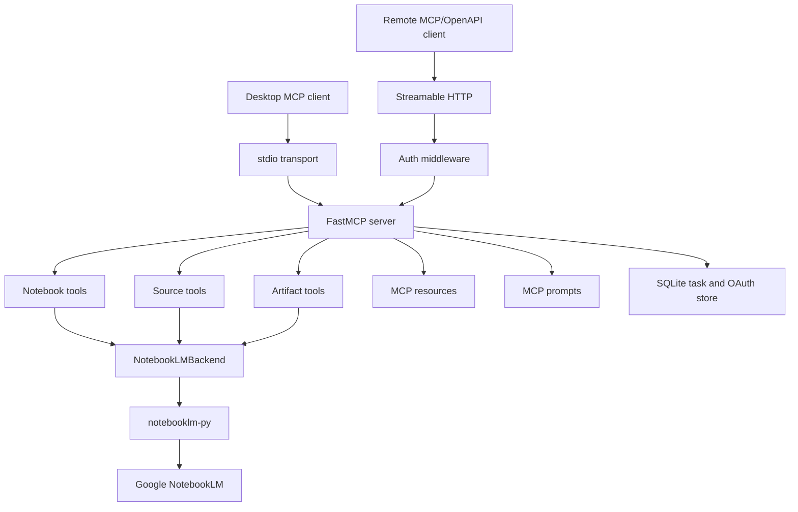

<div align="center">

# notebooklm-mcp-pro

**Production-grade [Model Context Protocol](https://modelcontextprotocol.io) server for [Google NotebookLM](https://notebooklm.google.com)**

[](https://github.com/oaslananka/notebooklm-mcp-pro/actions/workflows/ci.yml)
[](https://pypi.org/project/notebooklm-mcp-pro/)
[](https://pypi.org/project/notebooklm-mcp-pro/)
[](LICENSE)
[](https://codecov.io/gh/oaslananka/notebooklm-mcp-pro)
[](https://github.com/oaslananka/notebooklm-mcp-pro/actions/workflows/scorecard.yml)
[](https://github.com/astral-sh/ruff)

Connect any MCP-capable client to Google NotebookLM.
Works with **Claude Desktop**, **Claude.ai**, **ChatGPT**, **Cursor**, **VS Code Continue**, and any client that speaks MCP or OpenAPI.

[Documentation](https://oaslananka.github.io/notebooklm-mcp-pro/) ·
[Quick Start](#-quick-start) ·
[Tools](#-tools) ·
[Integrations](#-integrations)

</div>

---

## ✨ Features

- One Python package.
- One CLI.
- One server factory.
- Local stdio transport.
- Remote Streamable HTTP transport.
- Bearer token authentication.
- GitHub OAuth authentication.
- ChatGPT Custom Actions through OpenAPI 3.1.
- Plugin manifest at `/.well-known/ai-plugin.json`.
- OAuth metadata endpoints.
- Notebook tools.
- Source ingestion tools.
- Chat tools.
- Research tools.
- Artifact generation tools.
- Artifact lifecycle tools.
- Language tools.
- Admin tools.
- ChatGPT-compatible `search`.
- ChatGPT-compatible `fetch`.
- Typed Pydantic inputs.
- Typed output models where the MCP surface needs stable shapes.
- Tool safety annotations.
- Confirmation checks for destructive operations.
- SQLite task tracking.
- SQLite OAuth sessions.
- Structured logging through structlog.
- Offline unit tests.
- Subprocess stdio integration test.
- HTTP auth tests.
- OpenAPI tests.
- Coverage gate.
- Ruff formatting.
- Strict mypy.
- MkDocs Material documentation.
- Docker image.
- Docker Compose template.
- Railway template.
- Fly.io template.
- Kubernetes manifests.
- Release workflow with wheel, sdist, SBOM, Sigstore bundles, PyPI, and GHCR publishing.
- OpenSSF Scorecard workflow with SARIF upload and optional public result publishing.
- ClusterFuzzLite scheduled fuzzing for configuration-boundary validation.
- Digest-pinned Docker base images.
- SHA-pinned GitHub Actions.

---

## Why this exists

Google NotebookLM is useful for research notebooks, source-grounded chat, study material, and artifact generation.

MCP clients need a stable programmatic bridge.

`notebooklm-mcp-pro` provides that bridge.

It exposes NotebookLM actions as MCP tools.

It exposes NotebookLM records as MCP resources.

It exposes workflow starters as MCP prompts.

It also exposes an OpenAPI action surface for clients that integrate through HTTP schemas.

---

## 📦 Installation

### uv

```bash
uv tool install notebooklm-mcp-pro
nlm-mcp --version
```

### pip

```bash
python -m pip install --upgrade notebooklm-mcp-pro
nlm-mcp --version
```

### pipx

```bash
pipx install notebooklm-mcp-pro
nlm-mcp --version
```

### Full optional install

```bash
python -m pip install "notebooklm-mcp-pro[all]"
```

### From source

```bash
git clone https://github.com/oaslananka/notebooklm-mcp-pro
cd notebooklm-mcp-pro
make bootstrap
make test
```

---

## NotebookLM login

Run the NotebookLM browser login once. This uses `python -m notebooklm` under
the hood, so it works even when the dependency's `notebooklm` console script is
not on `PATH`. The base package includes the browser-login dependency, so this
works after a plain `pip install notebooklm-mcp-pro` or `uv tool install
notebooklm-mcp-pro`. The command also installs the Playwright Chromium browser
binary before it starts NotebookLM's login flow:

```bash
nlm-mcp login
```

The dependency package is named `notebooklm-py`, but the console script it
installs is named `notebooklm`. If you want to run the backend CLI directly:

```bash
notebooklm --storage ~/.config/nlm-mcp/notebooklm_auth.json login
```

On Windows PowerShell:

```powershell
New-Item -ItemType Directory -Force "$env:USERPROFILE\.config\nlm-mcp"
notebooklm --storage "$env:USERPROFILE\.config\nlm-mcp\notebooklm_auth.json" login
```

If the console script directory is not on `PATH`, use the module entrypoint:

```bash
python -m notebooklm --storage ~/.config/nlm-mcp/notebooklm_auth.json login
```

For isolated `uv` usage without a global install:

```bash
uvx --from "notebooklm-py[browser]" notebooklm --storage ~/.config/nlm-mcp/notebooklm_auth.json login
```

The default auth file is:

```text
~/.config/nlm-mcp/notebooklm_auth.json
```

If that file is not present, the server also detects the NotebookLM CLI default
profile at:

```text
~/.notebooklm/profiles/default/storage_state.json
```

Override it with:

```bash
export NLM_MCP_NOTEBOOKLM_AUTH_FILE=/secure/path/notebooklm_auth.json
```

For containers:

```bash
export NLM_MCP_NOTEBOOKLM_AUTH_JSON='{"cookies":[],"origins":[]}'
```

Treat this JSON as a secret.

---

## 🚀 Quick Start

### Local stdio

```bash
pip install notebooklm-mcp-pro
nlm-mcp login
nlm-mcp stdio
```

Use this mode for local desktop clients.

It does not add an HTTP auth layer.

The caller process controls access.

### Remote HTTP with bearer token

```bash
export NLM_MCP_TRANSPORT=http
export NLM_MCP_AUTH_MODE=token
export NLM_MCP_BEARER_TOKEN="$(python -c 'import secrets; print(secrets.token_urlsafe(32))')"
export NLM_MCP_BASE_URL=https://your-server.example.com
nlm-mcp serve --host 0.0.0.0 --port 8080
```

Test:

```bash
curl https://your-server.example.com/healthz
curl -H "Authorization: Bearer $NLM_MCP_BEARER_TOKEN" \
  https://your-server.example.com/mcp
```

### Remote HTTP with GitHub OAuth

```bash
export NLM_MCP_TRANSPORT=http
export NLM_MCP_AUTH_MODE=github-oauth
export NLM_MCP_BASE_URL=https://your-server.example.com
export NLM_MCP_GITHUB_CLIENT_ID=your-client-id
export NLM_MCP_GITHUB_CLIENT_SECRET=your-client-secret
export NLM_MCP_OAUTH_ALLOWED_USERS=oaslananka
nlm-mcp serve --host 0.0.0.0 --port 8080
```

Users start at:

```text
https://your-server.example.com/auth/login
```

Hosted MCP clients that support OAuth 2.1 can start from the clean MCP endpoint:

```text
https://your-server.example.com/mcp
```

The server publishes OAuth discovery metadata and exposes `/oauth/authorize`,
`/oauth/token`, and `/oauth/register` for authorization-code + PKCE flows backed
by the configured GitHub OAuth App.

---

## 🔌 Integrations

### Claude Desktop

Add this to the desktop config file.

macOS:

```text
~/Library/Application Support/Claude/claude_desktop_config.json
```

Windows:

```text
%APPDATA%\Claude\claude_desktop_config.json
```

Linux:

```text
~/.config/Claude/claude_desktop_config.json
```

Config:

```json
{
  "mcpServers": {
    "notebooklm": {
      "command": "nlm-mcp",
      "args": ["stdio"],
      "env": {
        "NLM_MCP_LOG_LEVEL": "WARNING"
      }
    }
  }
}
```

With `uvx`:

```json
{
  "mcpServers": {
    "notebooklm": {
      "command": "uvx",
      "args": ["notebooklm-mcp-pro", "stdio"]
    }
  }
}
```

### Claude.ai Web

Deploy the HTTP server with a public HTTPS URL.

Use:

```text
https://your-server.example.com/mcp
```

Choose bearer token or OAuth based on server configuration.

Run `admin_health` to verify.

### ChatGPT Custom Actions

Deploy the HTTP server.

Import:

```text
https://your-server.example.com/openapi.json
```

Set authentication to bearer token when `NLM_MCP_AUTH_MODE=token`.

The action endpoints are:

```text
POST /tools/{tool_name}
```

The manifest is:

```text
GET /.well-known/ai-plugin.json
```

### Cursor

Use the same local stdio config shape:

```json
{
  "mcpServers": {
    "notebooklm": {
      "command": "nlm-mcp",
      "args": ["stdio"]
    }
  }
}
```

### VS Code Continue

Use local stdio or remote HTTP depending on your Continue configuration.

Local command:

```text
nlm-mcp stdio
```

Remote endpoint:

```text
https://your-server.example.com/mcp
```

---

## 🛠 Tools

MCP-visible tool names use underscores for compatibility with VS Code and other
strict clients. The OpenAPI action paths keep the canonical dotted names such as
`/tools/notebook.list`.

### Notebook tools

| Tool | Purpose | Safety |
|---|---|---|
| `notebook_list` | List notebooks | read-only |
| `notebook_create` | Create a notebook | mutating |
| `notebook_get` | Get notebook metadata | read-only |
| `notebook_rename` | Rename a notebook | idempotent |
| `notebook_delete` | Delete a notebook | destructive, confirmation required |
| `notebook_share_public` | Toggle public sharing | destructive, confirmation required when enabling |
| `notebook_share_invite` | Invite collaborator | mutating, confirmation required |
| `notebook_share_status` | Read sharing settings | read-only |

### Source tools

| Tool | Purpose | Safety |
|---|---|---|
| `source_add_url` | Add a web URL | mutating |
| `source_add_youtube` | Add a YouTube video | mutating |
| `source_add_file` | Upload a local file | mutating |
| `source_add_gdrive` | Add a Google Drive document | mutating |
| `source_add_text` | Add pasted text | mutating |
| `source_list` | List sources | read-only |
| `source_get` | Get source metadata | read-only |
| `source_get_fulltext` | Get indexed text | read-only |
| `source_refresh` | Re-index a source | idempotent |
| `source_wait` | Wait for indexing | read-only, blocking |
| `source_remove` | Remove a source | destructive, confirmation required |

### Chat tools

| Tool | Purpose |
|---|---|
| `chat_ask` | Ask a one-shot question |
| `chat_query` | OpenAPI alias for asking |
| `chat_stream_query` | Stream-oriented alias returning a completed result |
| `chat_conversation_start` | Start or identify a conversation |
| `chat_continue` | Continue a conversation |
| `chat_history` | Read conversation history |
| `chat_save_to_notes` | Save content as a note |
| `chat_save_note` | Alias for note save |
| `chat_list_notes` | List notes |

### Research tools

| Tool | Purpose |
|---|---|
| `research_web_start` | Start web research |
| `research_drive_start` | Start Drive research |
| `research_status` | Poll research status |
| `research_wait` | Wait for research and optionally import sources |

### Generation tools

| Tool | Output |
|---|---|
| `generate_audio_overview` | Audio overview |
| `generate_video_overview` | Video overview |
| `generate_cinematic_video` | Cinematic video |
| `generate_slide_deck` | Slide deck |
| `generate_infographic` | Infographic |
| `generate_quiz` | Quiz |
| `generate_flashcards` | Flashcards |
| `generate_report` | Report |
| `generate_data_table` | Data table |
| `generate_mind_map` | Mind map |

### Artifact lifecycle tools

| Tool | Purpose |
|---|---|
| `artifact_list` | List artifacts and tracked tasks |
| `artifact_status` | Poll task status |
| `artifact_wait` | Wait for task completion |
| `artifact_download` | Download an artifact |
| `artifact_delete` | Delete an artifact when supported |
| `artifact_cancel` | Cancel a task when supported |
| `artifact_revise_slide` | Revise one slide |

### Language tools

| Tool | Purpose |
|---|---|
| `language_list` | List supported languages |
| `language_get` | Read current output language |
| `language_set` | Set account-global output language |

### Compatibility tools

| Tool | Purpose |
|---|---|
| `search` | Return matching record IDs |
| `fetch` | Return full record by ID |

### Admin tools

| Tool | Purpose |
|---|---|
| `admin_health` | Server health |
| `admin_version` | Package and runtime version |

---

## ⚙️ Configuration

| Variable | Default | Description |
|---|---|---|
| `NLM_MCP_TRANSPORT` | `stdio` | `stdio` or `http` |
| `NLM_MCP_HTTP_HOST` | `0.0.0.0` | HTTP bind host |
| `NLM_MCP_HTTP_PORT` | `8080` | HTTP bind port |
| `NLM_MCP_HTTP_PATH` | `/mcp` | MCP endpoint path |
| `NLM_MCP_BASE_URL` | unset | Public URL |
| `NLM_MCP_AUTH_MODE` | `none` | `none`, `token`, or `github-oauth` |
| `NLM_MCP_BEARER_TOKEN` | unset | Token auth secret |
| `NLM_MCP_GITHUB_CLIENT_ID` | unset | OAuth client ID |
| `NLM_MCP_GITHUB_CLIENT_SECRET` | unset | OAuth client secret |
| `NLM_MCP_OAUTH_ALLOWED_USERS` | unset | GitHub username allowlist |
| `NLM_MCP_NOTEBOOKLM_AUTH_FILE` | `~/.config/nlm-mcp/notebooklm_auth.json` | NotebookLM auth file |
| `NLM_MCP_NOTEBOOKLM_AUTH_JSON` | unset | Inline NotebookLM auth JSON |
| `NLM_MCP_DATA_DIR` | `~/.local/share/nlm-mcp` | Runtime data directory |
| `NLM_MCP_LOG_LEVEL` | `INFO` | Log level |
| `NLM_MCP_LOG_FORMAT` | `json` | `json` or `console` |

See [Configuration](https://oaslananka.github.io/notebooklm-mcp-pro/configuration/) for the full table.

---

## 🐳 Docker

### Build

```bash
docker build -f deploy/Dockerfile -t notebooklm-mcp-pro:dev .
```

### Run

```bash
docker run --rm -p 8080:8080 \
  -e NLM_MCP_TRANSPORT=http \
  -e NLM_MCP_AUTH_MODE=token \
  -e NLM_MCP_BEARER_TOKEN=replace-with-generated-token \
  -e NLM_MCP_BASE_URL=http://localhost:8080 \
  notebooklm-mcp-pro:dev
```

### Compose

```bash
docker compose -f deploy/docker-compose.yml up --build
```

### Pull

```bash
docker pull ghcr.io/oaslananka/notebooklm-mcp-pro:latest
```

---

## HTTP Endpoints

| Endpoint | Purpose | Auth |
|---|---|---|
| `GET /healthz` | health check | exempt |
| `GET /openapi.json` | OpenAPI schema | exempt |
| `GET /.well-known/ai-plugin.json` | plugin manifest | exempt |
| `GET /.well-known/oauth-protected-resource` | OAuth resource metadata | exempt |
| `GET /.well-known/oauth-authorization-server` | OAuth server metadata | exempt |
| `GET /auth/login` | GitHub OAuth login | exempt |
| `GET /auth/callback` | GitHub OAuth callback | exempt |
| `GET /oauth/authorize` | MCP OAuth authorization endpoint | exempt |
| `POST /oauth/token` | MCP OAuth token endpoint | exempt |
| `POST /oauth/register` | Dynamic OAuth client registration | exempt |
| `POST /tools/{tool_name}` | OpenAPI tool action | authenticated |
| `/mcp` | Streamable HTTP MCP endpoint | authenticated |

---

## Architecture



---

## 🔒 Security

- Do not expose HTTP mode publicly without auth.
- Use bearer tokens for personal deployments.
- Use GitHub OAuth for multi-user deployments.
- Store NotebookLM auth JSON in a secret manager.
- Mount auth files read/write in long-running containers so refreshed cookies
  can be persisted; use read-only mounts only for immutable deployments.
- Keep `NLM_MCP_BASE_URL` on HTTPS for OAuth.
- Artifact downloads are constrained to the artifacts directory.
- Destructive tools require explicit confirmation.
- CI runs lint, typecheck, tests, dependency audit, static analysis, and secret scanning.
- OpenSSF Scorecard runs on `main`, publishes SARIF, and can publish public Scorecard badge/API results when GitHub-hosted runners are available.
- ClusterFuzzLite runs scheduled Atheris fuzzing for settings validation.
- GitHub Actions use top-level read-only permissions and job-level write scopes.
- Release assets are signed with Sigstore bundles.
- Docker build images are pinned by digest.

See [Security](SECURITY.md).

---

## Development

```bash
make bootstrap
make lint
make typecheck
make test
make docs
```

Generate the catalog:

```bash
make catalog
```

Run the HTTP server:

```bash
make run-http
```

Run the stdio server:

```bash
make run-stdio
```

---

## Release

Releases are cut from tags:

```bash
git tag vX.Y.Z
git push origin vX.Y.Z
```

The release workflow validates the tag, builds distributions, generates an SBOM, signs release assets with Sigstore, publishes to PyPI, pushes GHCR images, and creates a GitHub release.

---

## Roadmap

Planned follow-up work:

- Additional OAuth providers.
- Shared Redis-backed rate limiting.
- Hosted UI widgets for richer artifact previews.
- More recorded NotebookLM fixtures.
- More deployment blueprints.

See `docs/ROADMAP.md`.

---

## 🤝 Contributing

Contributions are welcome when they are scoped, tested, and documented.

Read [CONTRIBUTING.md](CONTRIBUTING.md).

Before opening a PR:

```bash
make lint
make typecheck
make test
make docs
```

Use Conventional Commits.

---

## 📄 License

MIT License.

See [LICENSE](LICENSE).
