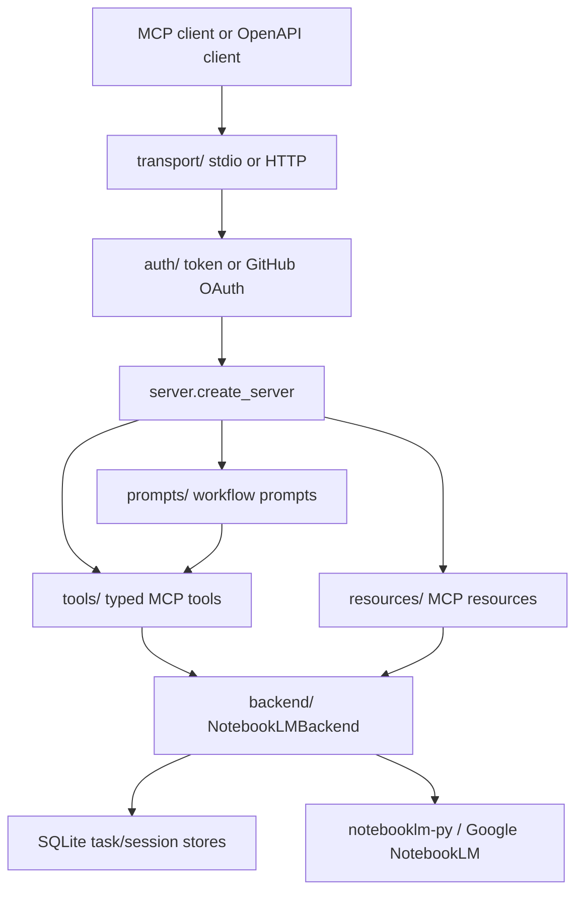

# Architecture

`notebooklm-mcp-pro` is a Python MCP server with two first-class transports:
local stdio and remote Streamable HTTP. The implementation is intentionally
layered so transport, authentication, NotebookLM backend access, MCP tools, and
documentation can be changed independently.

## Layers

| Layer | Path | Responsibility |
|---|---|---|
| Configuration | `src/nlm_mcp/config.py` | Environment, `.env`, and CLI-derived settings. |
| Logging | `src/nlm_mcp/logging_setup.py` | Structured logging defaults. |
| Authentication | `src/nlm_mcp/auth/` | Bearer token middleware, GitHub OAuth, and session verification. |
| Backend | `src/nlm_mcp/backend/` | NotebookLM wrapper, retries, exception mapping, task persistence. |
| MCP server | `src/nlm_mcp/server.py` | FastMCP factory and registry wiring. |
| Tools | `src/nlm_mcp/tools/` | Typed MCP tool families and ChatGPT compatibility tools. |
| Resources | `src/nlm_mcp/resources/` | `notebooklm://` resources and artifact metadata resources. |
| Prompts | `src/nlm_mcp/prompts/` | Named workflow prompt templates. |
| Transport | `src/nlm_mcp/transport/` | stdio and HTTP runtime entry points. |
| Deployment | `deploy/` | Docker, Compose, Fly, Railway, and Kubernetes templates. |

## Boundary Rules

- Tools call the backend wrapper, not `notebooklm-py` directly.
- Auth middleware does not import tool modules.
- Backend modules do not import transport modules.
- CLI commands create settings, configure logging, and delegate to transport
  runners.
- Public docs are kept in `docs/`; short operational guidance is kept in
  `AGENTS.md`.

These rules keep the codebase navigable and make future automated checks easier
to add without changing runtime behavior.

## Request Lifecycle

1. A client connects over stdio or Streamable HTTP.
2. HTTP requests pass through auth middleware unless the path is explicitly
   exempt, such as `/healthz` or `/openapi.json`.
3. FastMCP dispatches tool, resource, or prompt calls to registered handlers.
4. Tool handlers validate typed inputs, call `NotebookLMBackend`, and return
   typed output models.
5. Backend errors are mapped to sanitized domain errors before returning to the
   MCP client.
6. Artifact generation tasks are tracked in SQLite-backed task storage.

## Supply Chain Controls

- CI runs lint, formatting, strict type checking, tests, and package build.
- Security workflow runs dependency audit, Bandit SARIF upload, and Gitleaks.
- CodeQL runs on `main` and on a weekly schedule.
- OpenSSF Scorecard runs on `main` and on a weekly schedule.
- Release workflow publishes PyPI and GHCR artifacts, generates a CycloneDX SBOM,
  and signs release assets with Sigstore bundles.
