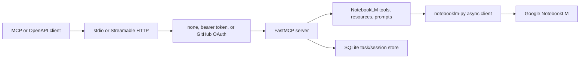

# notebooklm-mcp-pro

**Production-grade [Model Context Protocol](https://modelcontextprotocol.io) server for [Google NotebookLM](https://notebooklm.google.com).**

[](https://github.com/oaslananka/notebooklm-mcp-pro/actions/workflows/ci.yml)
[](https://pypi.org/project/notebooklm-mcp-pro/)
[](https://pypi.org/project/notebooklm-mcp-pro/)
[](https://github.com/oaslananka/notebooklm-mcp-pro/blob/main/LICENSE)
[](https://github.com/oaslananka/notebooklm-mcp-pro/actions)

`notebooklm-mcp-pro` connects MCP-compatible clients to Google NotebookLM through one Python package. It supports local stdio transport for desktop clients and Streamable HTTP for remote integrations, including bearer token and GitHub OAuth authentication.

## What you can do

| Category | Tools |
|---|---|
| Notebooks | List, create, rename, delete, share publicly, invite collaborators |
| Sources | Add URLs, YouTube videos, files, Google Drive docs, and pasted text |
| Chat | Ask questions, continue conversations, save notes, list notes |
| Research | Start web or Drive research, poll status, wait for completion |
| Artifacts | Generate audio, video, cinematic video, slides, infographics, reports, tables, quizzes, flashcards, and mind maps |
| Language | List supported languages and set the account-global output language |
| Admin | Health, version, OpenAPI, plugin manifest, OAuth metadata |

## 60-second start

=== "pip"
    ```bash
    pip install notebooklm-mcp-pro
    notebooklm-py login
    nlm-mcp stdio
    ```

=== "uv"
    ```bash
    uv tool install notebooklm-mcp-pro
    notebooklm-py login
    nlm-mcp stdio
    ```

=== "Docker"
    ```bash
    docker run --rm -p 8080:8080 \
      -e NLM_MCP_TRANSPORT=http \
      -e NLM_MCP_AUTH_MODE=token \
      -e NLM_MCP_BEARER_TOKEN="$(python -c 'import secrets; print(secrets.token_urlsafe(32))')" \
      ghcr.io/oaslananka/notebooklm-mcp-pro:latest
    ```

## Choose your integration

- [Claude Desktop](integrations/claude-desktop.md)
- [Claude.ai Web](integrations/claude-web.md)
- [ChatGPT Custom Actions](integrations/chatgpt.md)
- [Cursor](integrations/cursor.md)
- [VS Code Continue](integrations/vscode.md)

## Architecture



## Next steps

Read [Installation](getting-started/installation.md), configure [Authentication](getting-started/authentication.md), and use the [Tools Reference](tools/notebooks.md) to map client prompts to tool calls.
